# [Corporate UI Dashboard PRO Laravel](https://corporate-ui-dashboard-pro-laravel.creative-tim.com)


[](https://github.com/creativetimofficial/ct-corporate-ui-dashboard-pro-laravel/issues?q=is%3Aopen+is%3Aissue)
[](https://github.com/creativetimofficial/ct-corporate-ui-dashboard-pro-laravel/issues?q=is%3Aissue+is%3Aclosed)

_Frontend version_: Corporate UI Dashboard PRO v1.0.0. More info at https://demos.creative-tim.com/corporate-ui-dashboard-pro/pages/dashboards/default.html?ref=readme-cudp
[ 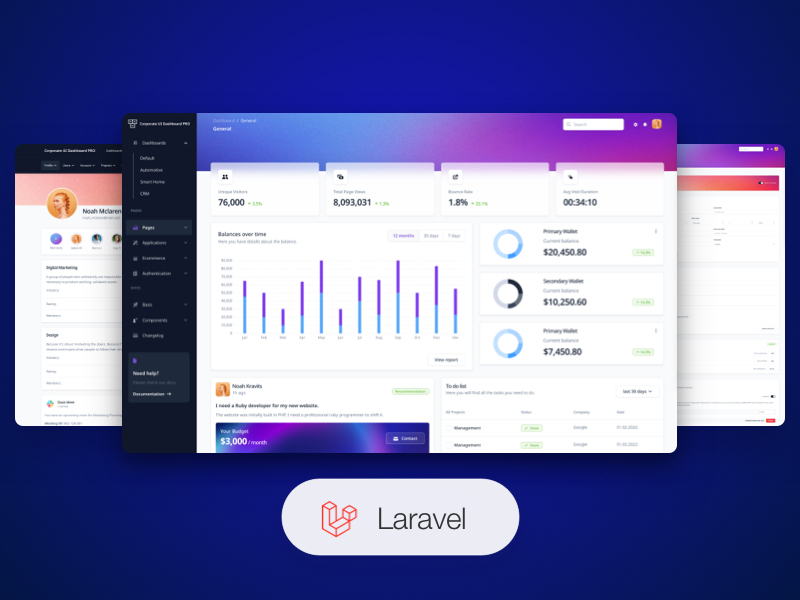](https://corporate-ui-dashboard-pro-laravel.creative-tim.com/)

Introducing Corporate UI Dashboard PRO Laravel, [Creative Tim](https://creative-tim.com/)'s newest Admin Template designed specifically for professional websites. Using our template, your web app pages will look excellent on all devices and perform flawlessly for a top-notch experience and happy customers.

Corporate UI Dashboard PRO is based on Bootstrap 5 and is made of hundred of elements, designed blocks, and fully coded pages. You can easily customize your projects to match your brand identity and specific needs.

Experience the power of our Admin Template and take your corporate website to the next level!

## Table of Contents

-   [Prerequisites](#prerequisites)
-   [Installation](#installation)
-   [Usage](#usage)
-   [Versions](#versions)
-   [Demo](#demo)
-   [Documentation](#documentation)
-   [Login](#login)
-   [Register](#register)
-   [Forgot Password](#forgot-password)
-   [Reset Password](#reset-password)
-   [User Profile](#my-profile)
-   [User Management](#user-management)
-   [Role Management](#role-management)
-   [Category Management](#category-management)
-   [Tag Management](#tag-management)
-   [File Structure](#file-structure)
-   [Browser Support](#browser-support)
-   [Reporting Issues](#reporting-issues)
-   [Licensing](#licensing)
-   [Useful Links](#useful-links)
-   [Social Media](#social-media)
-   [Credits](#credits)

## Prerequisites

If you don't already have an Apache local environment with PHP and MySQL, use one of the following links:

-   Windows: https://updivision.com/blog/post/beginner-s-guide-to-setting-up-your-local-development-environment-on-windows
-   Linux & Mac: https://updivision.com/blog/post/guide-what-is-lamp-and-how-to-install-it-on-ubuntu-and-macos

Also, you will need to install Composer: https://getcomposer.org/doc/00-intro.md  
And Laravel: https://laravel.com/docs/10.x

## Installation

1.Unzip the downloaded archive

2.Copy and paste `corporate-dashboard-pro-laravel` folder in your projects folder. Rename the folder to your project's name

3.In your terminal run composer install

4.Copy `.env.example` to `.env` and updated the configurations (mainly the database configuration)

5.In your terminal run `php artisan key:generate`

6.Run `php artisan migrate --seed` to create the database tables and seed the roles and users tables

7.Run `php artisan storage:link` to create the storage symlink (if you are using Vagrant with Homestead for development, remember to ssh into your virtual machine and run the command from there).

## Usage

Register an user or login with data from your database and start testing (make sure to run the migrations and seeders for the credentials to be available).

`admin@corporateui.com` and password `secret`

`creator@corporateui.com` and password `secret`

`member@corporateui.com` and password `secret`

Besides the dashboard, the auth pages, the billing and tables pages, it has also an edit profile page. All the necessary files are installed out of the box and all the needed routes are added to `routes/web.php`. Keep in mind that all of the features can be viewed once you login using the credentials provided or by registering your own user.

## Versions

[](https://demos.creative-tim.com/corporate-ui-dashboard-pro/pages/dashboards/default.html?ref=readme-cudp)
[](https://corporate-ui-dashboard-pro-laravel.creative-tim.com/?ref=sudl-readme)
| HTML | Laravel |
| --- | --- |
| [](https://www.creative-tim.com/product/corporate-ui-dashboard-pro) | [](https://www.creative-tim.com/product/corporate-ui-dashboard-pro-laravel)  | 


## Demo

| Register                                                                                                                   | Login                                                                                                                | Forgot Password Page                                                                                                                     |
| -------------------------------------------------------------------------------------------------------------------------- | -------------------------------------------------------------------------------------------------------------------- | ---------------------------------------------------------------------------------------------------------------------------------------- |
| [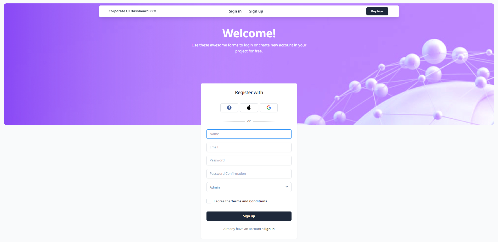](https://corporate-ui-dashboard-pro-laravel.creative-tim.com/register) | [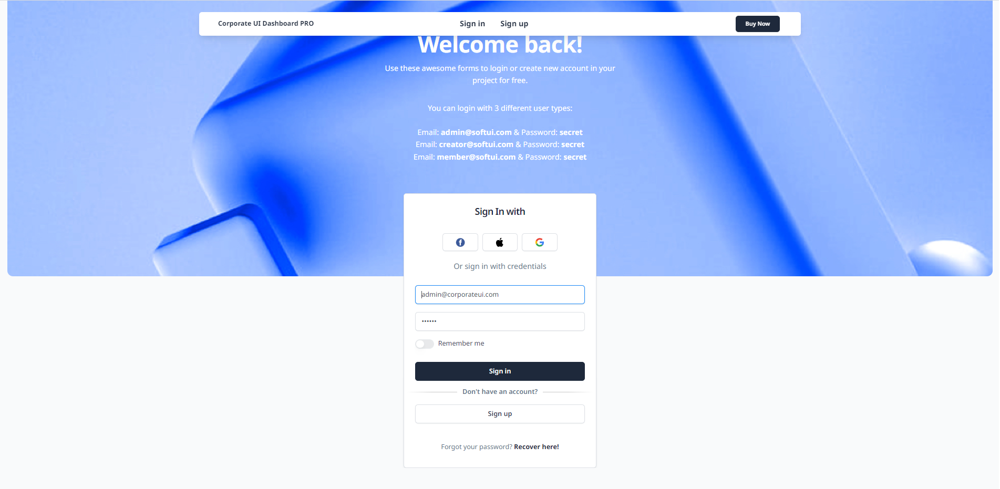](https://corporate-ui-dashboard-pro-laravel.creative-tim.com/login) | [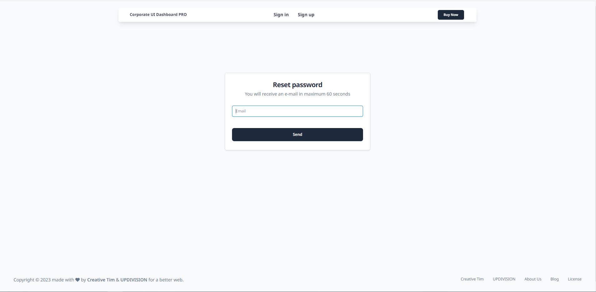](https://corporate-ui-dashboard-pro-laravel.creative-tim.com/forgot-password) |

| Reset Password Page                                                                                                           | User Profile                                                                                                                                        | User Management                                                                                                                                           |
| ----------------------------------------------------------------------------------------------------------------------------- | --------------------------------------------------------------------------------------------------------------------------------------------------- | --------------------------------------------------------------------------------------------------------------------------------------------------------- |
| [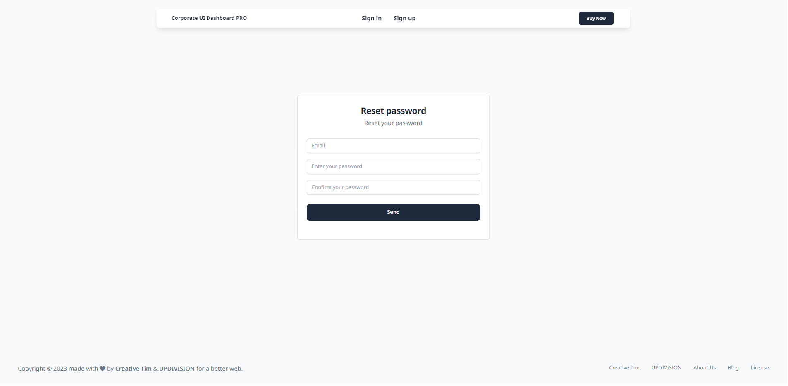](https://corporate-ui-dashboard-pro-laravel.creative-tim.com/login) | [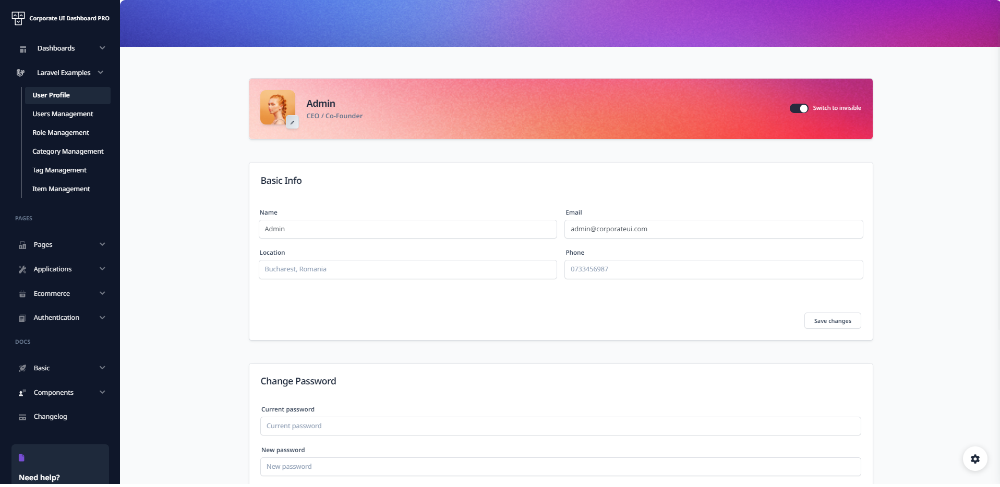](https://corporate-ui-dashboard-pro-laravel.creative-tim.com/laravel-examples/user-profile) | [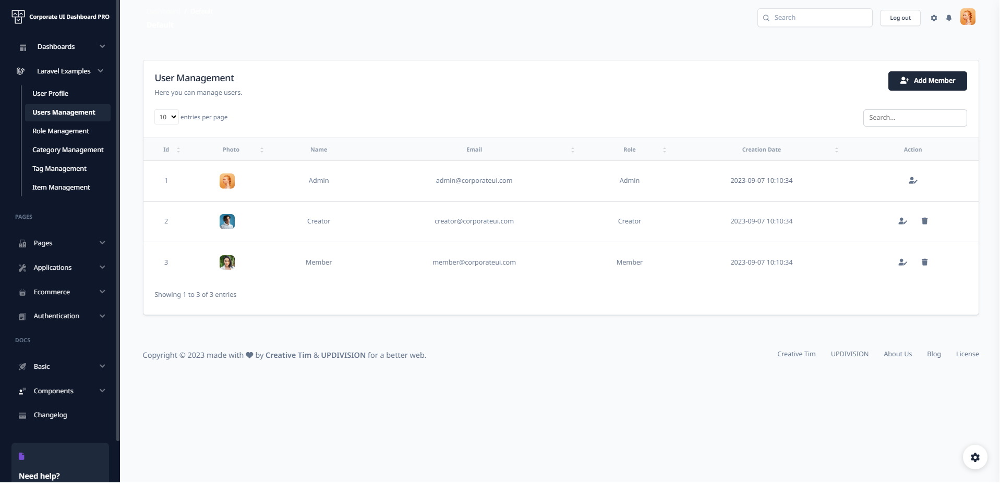](https://corporate-ui-dashboard-pro-laravel.creative-tim.com/laravel-examples/users-management) |

| Role Management                                                                                                                                           | Category Management                                                                                                                                               | Tag Management                                                                                                                                          |
| --------------------------------------------------------------------------------------------------------------------------------------------------------- | ----------------------------------------------------------------------------------------------------------------------------------------------------------------- | ------------------------------------------------------------------------------------------------------------------------------------------------------- |
| [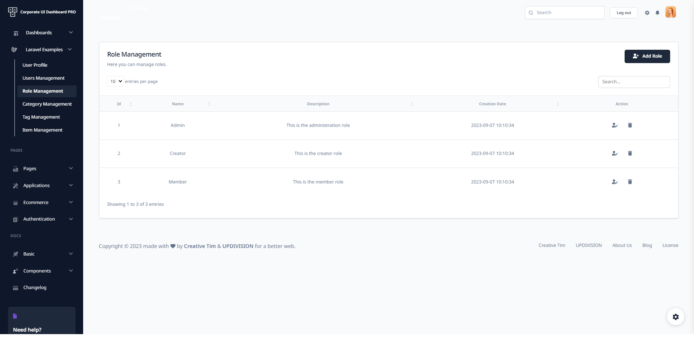](https://corporate-ui-dashboard-pro-laravel.creative-tim.com/laravel-examples/role-management) | [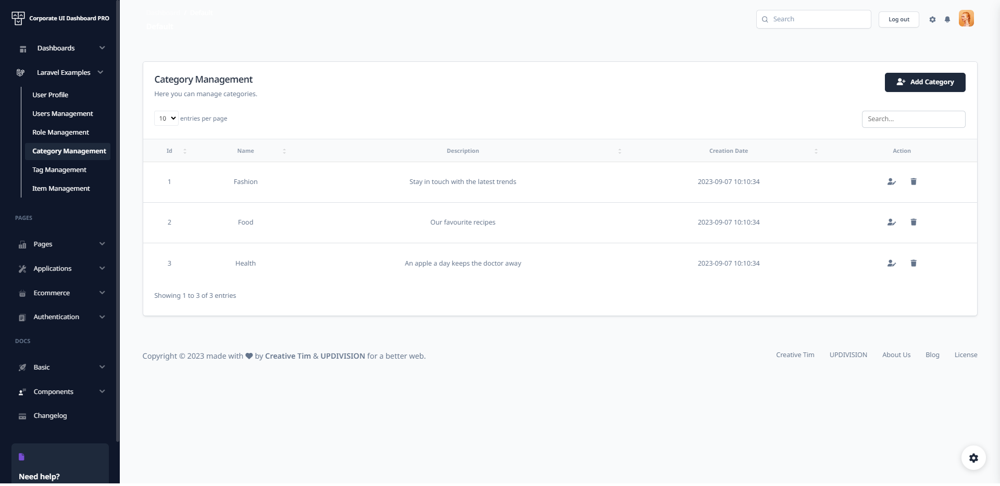](https://corporate-ui-dashboard-pro-laravel.creative-tim.com/laravel-examples/category-management) | [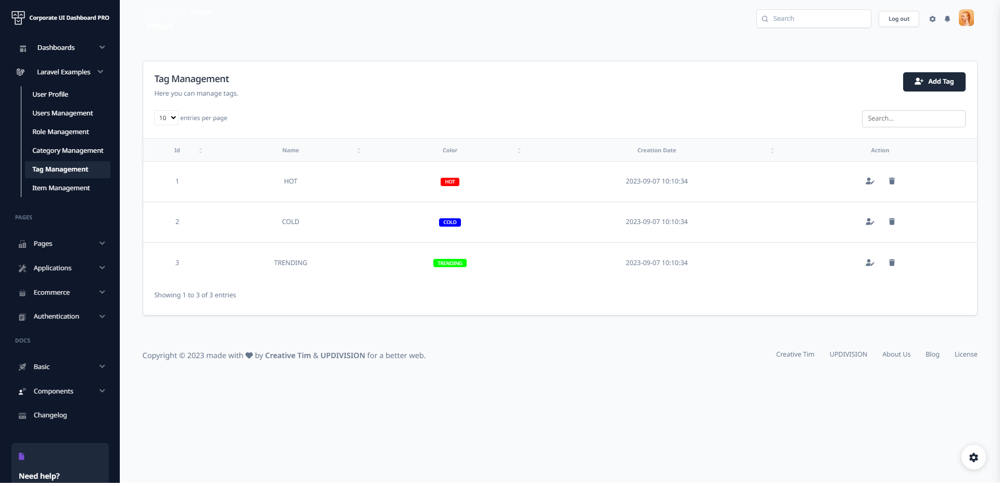](https://corporate-ui-dashboard-pro-laravel.creative-tim.com/laravel-examples/tag-management) |

| Item Management                                                                                                                                           | Dashboard                                                                                                                  | Automotive                                                                                                                             |
| --------------------------------------------------------------------------------------------------------------------------------------------------------- | -------------------------------------------------------------------------------------------------------------------------- | ------------------------------------------------------------------------------------------------------------------------------------------- |
| [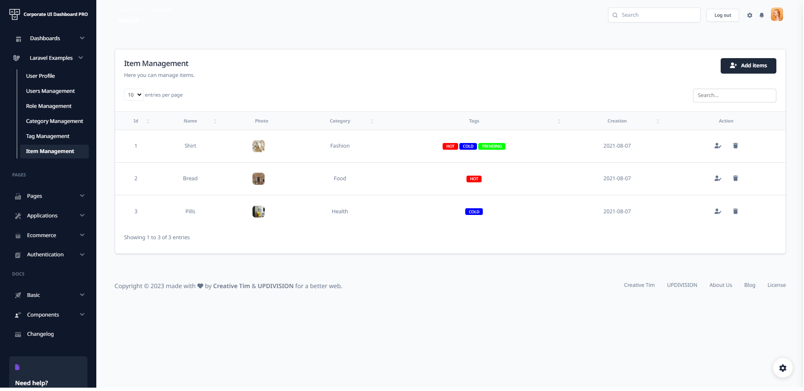](https://corporate-ui-dashboard-pro-laravel.creative-tim.com/laravel-examples/item-management) | [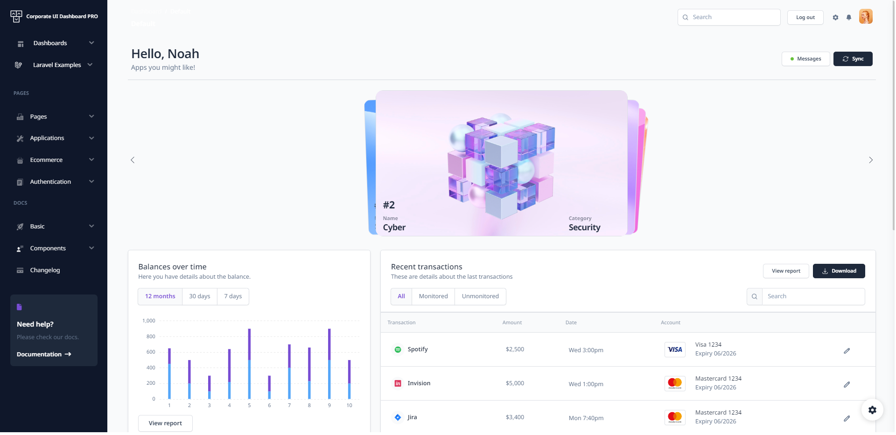](https://corporate-ui-dashboard-pro-laravel.creative-tim.com/dashboard) | [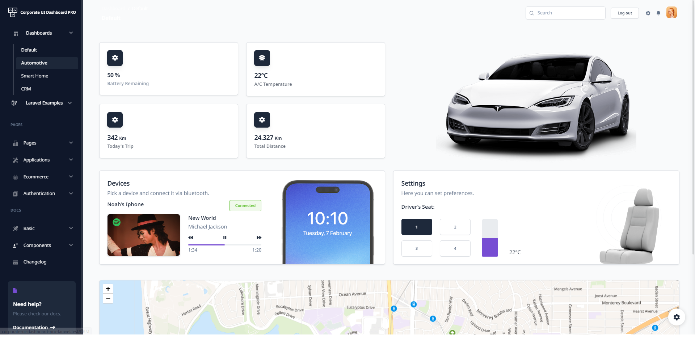](https://corporate-ui-dashboard-pro-laravel.creative-tim.com/automotive) |

[View More](https://corporate-ui-dashboard-pro-laravel.creative-tim.com/dashboard)

## Documentation

The documentation for the Corporate UI Dashboard Laravel is hosted at our [website](https://www.creative-tim.com/learning-lab/bootstrap/installation-guide/corporate-ui-dashboard).

### Login

The login functionality is fully implemented in our theme helping you to start your project in no time. To login into dashboard you just have to add /login in the URL and fill the login form with one of the credentials (user: `admin@corporateui.com`, `creator@corporateui.com`, `member@corporateui.com` and password: `secret`).

It uses the auth store located in `app/Http/Controllers/Auth/LoginController`.

```
public function store(Request $request)
    {

        $credentials = $request->only('email', 'password');

        $rememberMe = $request->rememberMe ? true : false;

        if (Auth::attempt($credentials, $rememberMe)) {
            $request->session()->regenerate();

            return redirect()->intended('/dashboard');
        }

        return back()->withErrors([
            'message' => 'The provided credentials do not match our records.',
        ])->withInput($request->only('email'));
    }
```

### Register

The register functionality is fully implemented in our theme helping you to start your project in no time. To register a new user you just have to add `/register` in the URL or click on signup link from login page and fill the register form with user details.

It uses the auth store located in `app/Http/Controllers/Auth/Register`.

```
public function store(Request $request)
    {

        $request->validate([

            'name' => 'required|min:3|max:255',
            'email' => 'required|email|max:255|unique:users',
            'password' => 'required|min:7|confirmed|max:255',
            'role_id' => 'required|integer|between:1,3',
            'terms' => 'accepted',
        ], [
            'name.required' => 'Name is required',
            'email.required' => 'Email is required',
            'password.required' => 'Password is required',
            'role_id.required' => 'Role is required',
            'terms.accepted' => 'You must accept the terms and conditions'
        ]);

        $user = User::create([
            'name' => $request->name,
            'email' => $request->email,
            'password' => Hash::make($request->password),
            'role_id' => $request->role_id,
            'profile_picture' => asset('assets/img/default-avatar.png')
        ]);


        Auth::login($user);

        return redirect(RouteServiceProvider::HOME);
    }
```

### Forgot password

If an existing user forgot his password he has the possibility of resetting his password.

If a user forgets the account's password it is possible to reset the password. For this the user should click on the `"Recover here"` under the login form.

The `app/Http/Controllers/Auth/ForgotPassword` takes care of sending an email to the user where he can reset the password afterwards.

```
public function store(Request $request)
    {
        $request->validate([
            'email' => 'required|email',
        ]);

        $status = Password::sendResetLink(
            $request->only('email')
        );

        return $status == Password::RESET_LINK_SENT
            ? back()->with('status', __($status))
            : back()->withInput($request->only('email'))
            ->withErrors(['email' => __($status)]);
    }
```

### Reset password

The user who forgot the password gets an email on the account's email address. The user can access the reset password page by clicking the button found in the email. The link for resetting the password is available for 60 minutes. The user must add the new password and confirm the password for his password to be updated. The user is redirected to the login page.

The `app/Http/Controllers/Auth/ResetPassword` takes care of reseting the password.

```
public function store(Request $request)
    {
        $request->validate([
            'token' => 'required',
            'email' => 'required|email',
            'password' => 'required|string|confirmed|min:8',
        ]);

        $status = Password::reset(
            $request->only('email', 'password', 'password_confirmation', 'token'),
            function ($user) use ($request) {
                $user->forceFill([
                    'password' => Hash::make($request->password),
                    'remember_token' => Str::random(60),
                ])->save();

                event(new PasswordReset($user));
            }
        );

        return $status == Password::PASSWORD_RESET
            ? redirect()->route('login')->with('status', __($status))
            : back()->withInput($request->only('email'))
            ->withErrors(['email' => __($status)]);
    }
```

### My Profile

The profile can be accessed by a logged in user by clicking "**User Profile**" from the sidebar. The user can add information like phone number, location or change name, email and password.

The store used for users form can be found in `app/Http/Controllers/ProfileController`

```
public function update(Request $request)
    {
        $request->validate([
            'name' => 'required|min:3|max:255',
            'email' => 'required|email|max:255|unique:users,email,' . Auth::id(),
            'location' => 'max:255',
            'phone' => 'max:255',
            'profile_picture' => 'image|mimes:jpeg,png,jpg,gif|max:2048',
        ], [
            'name.required' => 'Name is required',
            'email.required' => 'Email is required',
        ]);

        $user = User::find(Auth::id());

        $picture = $request->file('profile_picture');


        if ($user->profile_picture && $picture && file_exists(storage_path('app/public/' . $user->profile_picture))) {
            unlink(storage_path('app/public/' . $user->profile_picture));
        }

        $user->update([
            'name' => $request->name,
            'email' => $request->email,
            'location' => $request->location,
            'phone' => $request->phone,
            'profile_picture' => $picture ? '/storage/' . $picture->store('profile', 'public') : $user->profile_picture,
        ]);

        return back()->with('success', 'Profile updated successfully.');
    }
```

### User Management

The user management can be accessed by clicking "**User Management**" from the **Laravel Examples** section from the sidebar. This page is available for users with the **Admin** role and the user is able to **add**, **edit** and **delete** other users. For adding a new user you can press the "**+ Add User**". If you would like to edit or delete an user you can click on the **Action** column. It is also possible to sort the fields or to search in the fields.

On the page for adding a new user you will find a form which allows you to fill the information. All pages are generated using blade templates.

The store used for users form can be found in `app/Http/Controllers/UserController`

```
public function store(Request $request)
{

    $request->validate([

        'name' => 'required|min:3|max:255',
        'email' => 'required|email|max:255|unique:users',
        'password' => 'required|min:7|confirmed|max:255',
        'role_id' => 'required|integer|between:1,3',
        'profile_picture' => 'image|mimes:jpeg,png,jpg,gif|max:2048',
    ], [
        'name.required' => 'Name is required',
        'email.required' => 'Email is required',
        'password.required' => 'Password is required',
        'role_id.required' => 'Role is required'
    ]);

    $picture = $request->file('profile_picture');
    $photoPath = $picture ? '/storage/' . $picture->store('profile', 'public') : 'assets/img/default-avatar.png';

    $user = User::create([
        'name' => $request->name,
        'email' => $request->email,
        'password' => Hash::make($request->password),
        'role_id' => $request->role_id,
        'profile_picture' => $photoPath
    ]);


    return redirect(route('users-management'))->with('success', 'New member added successfully.');
}
```

### Role Management

The PRO version allows you to assign roles for users. The default roles are **Admin**, **Creator** and **Member**. The role management can be accessed by clicking "**Role Management**" from the **Laravel Examples** section of the sidebar. This page is available for users with the **Admin** role and the user is able to **add**, **edit** and **delete** roles. For adding a new role you can press the "**+ Add Role**" button. If you would like to edit or delete a role you can click on the **Action** column. It is also possible to sort the fields or to search in the fields.

On the page for adding a new role you will find a form which allows you to fill the name and the description of the new role.

The store used for role form is found in `app/Http/Controllers/RoleController`.

```
public function store(Request $request)
{
    $request->validate([

        'name' => 'required|min:3|max:255',
        'description' => 'required|min:3|max:255',
    ], [
        'name.required' => 'Name is required',
        'description.required' => 'Description is required',
    ]);

    $role = Role::create([
        'name' => $request->name,
        'description' => $request->description,
    ]);

    return redirect(route('role-management'))->with('success', 'New role added successfully.');
}
```

### Category Management

The theme has some default categories and any **Admin** or **Creator** users can manage these categories. The category management can be accessed by clicking "**Category Management**" from the **Laravel Examples** section of the sidebar. The authenticated user can **add**, **edit** and **delete** categories. For adding a new category you can press the "**+ Add Category**" button. If you would like to edit or delete a category you can click on the **Action** column. It is also possible to sort the fields or to search in the fields.

On the page for adding a new category you will find a form which allows you to fill the name and the description of the new category.

The store used for category form is found in `app/Http/Controllers/CategoryController`.

```
public function store(Request $request)
{
    $request->validate([

        'name' => 'required|min:3|max:255',
        'description' => 'required|min:3|max:255',
    ], [
        'name.required' => 'Name is required',
        'description.required' => 'Description is required',
    ]);

    $category = Category::create([
        'name' => $request->name,
        'description' => $request->description,
    ]);

    return redirect(route('category-management'))->with('success', 'New category added successfully.');
}

```

### Tag Management

The theme has some default tags and any **Admin** or **Creator** users can manage these tags.The tag management can be accessed by clicking "**Tag Managmenet**" from the **Laravel Examples** section from the sidebar. The authenticated user can **add**, **edit** and **delete** tags. For adding a new tag you can press the "**+ Add Tag**" button. If you would like to edit or delete a tag you can click on the **Action** column. It is also possible to sort the fields or to search in the fields.

On the page for adding a new category you will find a form which allows you to fill the name and the description of the new tag and on the edit page you will find a similar form for the changes you wish to make.

The store used for tag form can be found in `app/Http/Controllers/TagController`.

```
public function store(Request $request)
{
    $request->validate([

        'name' => 'required|min:3|max:255',
        'color' => 'required|min:3|max:255',
    ], [
        'name.required' => 'Name is required',
        'color.required' => 'color is required',
    ]);

    $tag = Tag::create([
        'name' => $request->name,
        'color' => $request->color,
    ]);

    return redirect(route('tag-management'))->with('success', 'New tag added successfully.');
}
```

### Item Management

Item Management is the most advanced example included in the PRO theme because every item has a picture, has a category and has multiple tags. The item management can be accessed by clicking "**Item Management**" from the **Laravel Examples** section of the sidebar. The authenticated user as an Admin or Creator can **add**, **edit** and **delete** items. For adding a new item you can press the "**+ Add Item**" button. If you would like to edit or delete an item you can click on the **Action** column. It is also possible to sort the fields or to search in the fields. The Member user can not take any actions on the item, he is only able to see the item management table.

On the page for adding a new item you will find a form which allows you to add an image of the item, to fill the name, description of the item, a dropdown to choose the category and a multiselect for the tags.

The store used for roles form is found in `app/Http/Controllers/ItemController`.

```
public function store(Request $request)
{
    $request->validate([
        'name' => 'required|min:3|max:255',
        'category_id' => 'required|exists:categories,id',
        'photo' => 'image|mimes:jpeg,png,jpg,gif,svg|max:2048',
        'description' => 'required|min:3|max:255',
        'tag_id' => 'required',
        'status' => 'required',
        'options' => 'required|array',
        'date' => 'required|date',
    ], [
        'name.required' => 'Name is required',
        'category_id.required' => 'Category is required',
        'status.required' => 'Status is required',
        'tag_id.required' => 'Tag is required',
        'description.required' => 'Description is required',
        'options.required' => 'Options are required',
        'date.required' => 'Date is required',
        'description.min' => 'Description must be at least 3 characters',
    ]);


    $picture = $request->file('photo');
    $photoPath = $picture ? '/storage/' . $picture->store('item', 'public') : '';

    $tags_id = $request->input('tag_id');

    $item = Item::create([
        'name' => $request->input('name'),
        'category_id' => $request->input('category_id'),
        'photo' => $photoPath,
        'description' => $request->input('description'),
        'status' => $request->input('status'),
        'options' => json_encode($request->input('options')),
        'date' => $request->input('date'),
    ]);

    sort($tags_id);
    $item->tags()->sync($tags_id, false);

    return redirect(route('item-management'))->with('success', 'New item added successfully.');
}
```

## File structure
```
.
|-- app
|   |-- Console
|   |   `-- Kernel.php
|   |-- Exceptions
|   |   `-- Handler.php
|   |-- Http
|   |   |-- Controllers
|   |   |   |-- Auth
|   |   |   |   |-- ForgotPasswordController.php
|   |   |   |   |-- LoginController.php
|   |   |   |   |-- RegisterController.php
|   |   |   |   `-- ResetPasswordController.php
|   |   |   |-- CategoryController.php
|   |   |   |-- Controller.php
|   |   |   |-- ItemController.php
|   |   |   |-- ProfileController.php
|   |   |   |-- RoleController.php
|   |   |   |-- TagController.php
|   |   |   `-- UserController.php
|   |   |-- Kernel.php
|   |   `-- Middleware
|   |       |-- Authenticate.php
|   |       |-- EncryptCookies.php
|   |       |-- PreventRequestsDuringMaintenance.php
|   |       |-- RedirectIfAuthenticated.php
|   |       |-- TrimStrings.php
|   |       |-- TrustHosts.php
|   |       |-- TrustProxies.php
|   |       |-- ValidateSignature.php
|   |       `-- VerifyCsrfToken.php
|   |-- Models
|   |   |-- Category.php
|   |   |-- Item.php
|   |   |-- Role.php
|   |   |-- Tag.php
|   |   `-- User.php
|   |-- Policies
|   |   |-- CategoryPolicy.php
|   |   |-- ItemPolicy.php
|   |   |-- RolePolicy.php
|   |   |-- TagPolicy.php
|   |   `-- UserPolicy.php
|   |-- Providers
|   |   |-- AppServiceProvider.php
|   |   |-- AuthServiceProvider.php
|   |   |-- BroadcastServiceProvider.php
|   |   |-- EventServiceProvider.php
|   |   `-- RouteServiceProvider.php
|   `-- View
|       `-- Components
|           |-- AppLayout.php
|           |-- GuestLayout.php
|           `-- navbarGuest.php
|....
```
## Reporting Issues

We use GitHub Issues as the official bug tracker for the Corporate UI Dashboard PRO Laravel. Here are some advices for our users that want to report an issue:

1. Make sure that you are using the latest version of the Corporate UI Dashboard PRO Laravel. Check the CHANGELOG from your dashboard on our [website](https://www.creative-tim.com/product/corporate-ui-dashboard-pro-laravel).
2. Providing us reproductible steps for the issue will shorten the time it takes for it to be fixed.
3. Some issues may be browser specific, so specifying the browser you encountered the issue on might help.

## Licensing

-   Copyright 2023 [Creative Tim](https://www.creative-tim.com?ref=readme-corporateuiprolaravel-readme)
-   Creative Tim [license](https://www.creative-tim.com/license?ref=readme-corporateuiprolaravel-readme)

## Useful Links

-   [Tutorials](https://www.youtube.com/channel/UCVyTG4sCw-rOvB9oHkzZD1w)
-   [Affiliate Program](https://www.creative-tim.com/affiliates/new) (earn money)
-   [Blog Creative Tim](http://blog.creative-tim.com/)
-   [Free Products](https://www.creative-tim.com/bootstrap-themes/free) from Creative Tim
-   [Premium Products](https://www.creative-tim.com/bootstrap-themes/premium?ref=corporateuiprolaravel-readme) from Creative Tim
-   [React Products](https://www.creative-tim.com/bootstrap-themes/react-themes?ref=corporateuiprolaravel-readme) from Creative Tim
-   [VueJS Products](https://www.creative-tim.com/bootstrap-themes/vuejs-themes?ref=corporateuiprolaravel-readme) from Creative Tim
-   [More products](https://www.creative-tim.com/bootstrap-themes?ref=corporateuiprolaravel-readme) from Creative Tim
-   Check our Bundles [here](https://www.creative-tim.com/bundles??ref=corporateuiprolaravel-readme)

### Social Media

### Creative Tim

Twitter: <https://twitter.com/CreativeTim?ref=corporateuiprolaravel-readme>

Facebook: <https://www.facebook.com/CreativeTim?ref=corporateuiprolaravel-readme>

Dribbble: <https://dribbble.com/creativetim?ref=corporateuiprolaravel-readme>

Instagram: <https://www.instagram.com/CreativeTimOfficial?ref=corporateuiprolaravel-readme>

### UPDIVISION:

Twitter: <https://twitter.com/updivision?ref=corporateuiprolaravel-readme>

Facebook: <https://www.facebook.com/updivision?ref=corporateuiprolaravel-readme>

Linkedin: <https://www.linkedin.com/company/updivision?ref=corporateuiprolaravel-readme>

UPDIVISION Blog: <https://updivision.com/blog/?ref=corporateuiprolaravel-readme>

## Credits

-   [Creative Tim](https://creative-tim.com/?ref=corporateuiprolaravel-readme)
-   [UPDIVISION](https://updivision.com/?ref=corporateuiprolaravel-readme)
